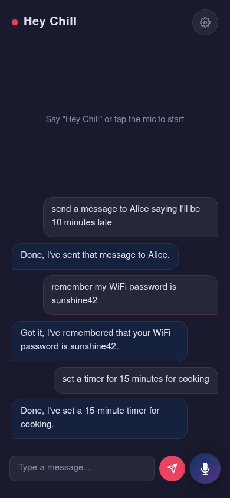
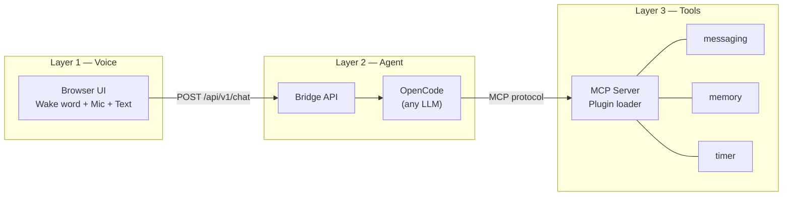

# Hey Chill

[](LICENSE)
[](https://python.org)
[](https://opencode.ai)
[](CONTRIBUTING.md)

**Voice-first personal assistant — speak to an AI agent that sends messages, remembers things, and sets timers. No apps, no screens.**

Like Siri, but open source. Like Alexa, but you own your data. Like a phone, but no screen needed.

<p align="center">
  
</p>

## The Problem

You unlock your phone 100+ times a day to do things that take 5 seconds each. Open app, tap, type, close. Repeat.

What if you just... said it?

> "Hey Chill, send a message to Alice saying I'll be late."
>
> "Remember my WiFi password is sunshine42."
>
> "Set a timer for 15 minutes for cooking."

Hey Chill is building toward a world where your voice is the only interface you need for daily tasks — messages, reminders, expenses, calendar, notes — all through one AI agent that knows you.

**[Live Demo](https://demo.heychill.dev)** *(coming soon)*

## Quick Start

```bash
# 1. Clone and configure
git clone https://github.com/user/voice-first-driver.git
cd voice-first-driver
cp .env.example .env   # add your API keys

# 2. Install and run
uv venv && uv pip install -r layer1_voice/requirements.txt -r layer2_agent/requirements.txt -r layer3_tools/requirements.txt

# 3. Start all layers
opencode serve --port 4096 &                                           # Layer 2: Agent brain
AGENT_URL=http://localhost:3001 uvicorn layer2_agent.bridge:app --port 3001 &  # Layer 2: Bridge
AGENT_URL=http://localhost:3001 uvicorn layer1_voice.server:app --port 3000    # Layer 1: Voice UI

# Open http://localhost:3000
```

Or with Docker:
```bash
docker compose up
```

## Architecture

Three layers, cleanly separated. Each is replaceable.



| Layer | What | Knows about | Doesn't know about |
|-------|------|------------|-------------------|
| **Voice** | Mic, wake word, TTS, text input | One HTTP endpoint | Agent internals, tools |
| **Agent** | Text in, reasoning, tool calls | MCP tool schemas | Voice, audio, UI |
| **Tools** | Its own domain logic | Its own data | Agent logic, other tools |

**Swap any layer.** Change the LLM by editing one line in `opencode.json`. Add a tool by dropping a Python module. Replace the UI entirely — the agent doesn't care.

## Features

| Feature | What it does | Type |
|---------|-------------|------|
| **Messaging** | "Send a message to Alice saying..." | External (fire & forget) |
| **Memory** | "Remember my passport number is..." / "What's my WiFi password?" | Embedded (your data) |
| **Timer** | "Set a timer for 15 minutes" | External (fire & forget) |
| Session memory | Agent remembers the conversation across messages | Built-in |
| Wake word | Say "Hey Chill" hands-free to start speaking | Built-in |
| Text input | Type in browser for testing without voice | Built-in |

## Add a Tool in 5 Minutes

Drop a Python file in `layer3_tools/tools/`. That's it.

```python
# layer3_tools/tools/expense.py

def register(mcp):
    @mcp.tool()
    def record_expense(amount: float, category: str, note: str = "") -> str:
        """Record a spending. Example: 'lunch cost 15 dollars'"""
        # Your logic here — write to SQLite, call an API, anything
        import json, os
        from datetime import datetime
        data_dir = os.environ.get("CHILL_DATA_DIR", "data")
        entry = {"amount": amount, "category": category, "note": note,
                 "timestamp": datetime.now().isoformat()}
        with open(os.path.join(data_dir, "expenses.jsonl"), "a") as f:
            f.write(json.dumps(entry) + "\n")
        return f"Recorded ${amount:.2f} for {category}."
```

Restart the server. The agent automatically discovers it and can use it:
> "Hey Chill, lunch cost 15 dollars."
> "Recorded $15.00 for lunch."

## Roadmap

| Phase | What | Status |
|-------|------|--------|
| **Now** | Messaging, Memory, Timers | Working |
| **Next** | Expense tracking, Todo lists, Shopping lists | Planned |
| **Later** | Calendar integration, Smart home, Navigation | Vision |
| **Dream** | Replace your phone homescreen entirely | North star |

## Tech Stack

**Layer 1:** Python, FastAPI, Web Speech API, openWakeWord (ONNX)
**Layer 2:** [OpenCode](https://opencode.ai), any LLM (Gemini, Claude, GPT)
**Layer 3:** MCP (Model Context Protocol), plugin architecture, SQLite (planned)

## License

MIT
